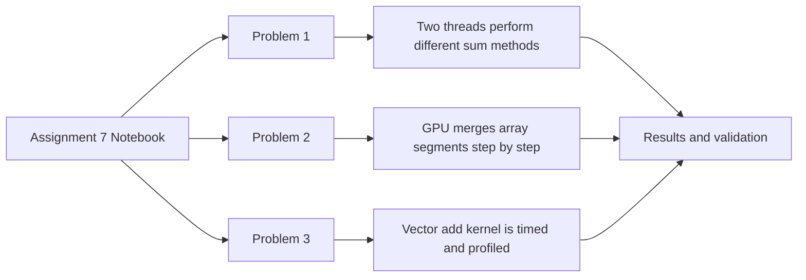

# LAB 7: CUDA Programming Assignment

This lab focuses on three small CUDA programs that demonstrate how GPU threads, parallel algorithms, and memory behavior affect performance. The notebook builds and runs each solution separately, then records the output for comparison.

## What This Assignment Covers

- Task-based work distribution across CUDA threads
- Parallel merge sort using a bottom-up approach
- Vector addition with timing and bandwidth analysis
- Basic performance interpretation using CUDA profiling tools

## Assignment Structure

| Problem   | Focus                   | Main Idea                                                                             |
| --------- | ----------------------- | ------------------------------------------------------------------------------------- |
| Problem 1 | Thread-level task split | Two CUDA threads compute the same sum in different ways and verify the result matches |
| Problem 2 | Parallel sorting        | A bottom-up merge sort merges array segments across GPU threads                       |
| Problem 3 | Memory throughput       | A vector-add kernel is timed and compared with theoretical bandwidth                  |

## High-Level Workflow

## Problem Summary

### Problem 1: Diverse Tasks in CUDA Threads

This problem shows that different threads in a CUDA kernel can execute different work based on thread ID. One thread computes the sum iteratively, while another uses the arithmetic formula. The goal is to confirm both approaches produce the same final value.

### Problem 2: Parallel Merge Sort

This problem uses a bottom-up merge sort strategy. Each pass merges increasingly larger sorted segments until the full array is sorted. The emphasis is on how GPU threads can cooperate to process many merge operations in parallel.

### Problem 3: Vector Addition and Bandwidth Analysis

This problem measures the runtime of a large vector addition kernel and compares measured bandwidth with the GPU's theoretical memory bandwidth. It highlights the difference between raw hardware capability and real kernel performance.

## Key Observations

- Problem 1 validates that both sum methods return the same result.
- Problem 2 demonstrates a working GPU-based merge process on an unsorted array.
- Problem 3 shows how timing data can be converted into an approximate bandwidth estimate.
- The notebook also uses profiling output to give a basic performance view of kernel and memory activity.

## Deliverables

- Assignment7.ipynb
- Generated CUDA source files created during notebook execution
- Console output and profiling results for each problem

## Notes

- The notebook is intended for a CUDA-enabled environment.
- The README focuses on the assignment narrative and avoids reproducing code.
- If you want, this file can be expanded later with screenshots of outputs or a results summary table.
